# Release Design

## Release Permissions

`Cloud Custodian` requires the contributor role to manipulate Azure resources. During `setup.sh`, a Service Principal is created and stored into Azure KeyVault for Cloud Custodian. In the following release setup, we will retrieve this Service Principal and use it.

## Release Setup

1. Create a new release

    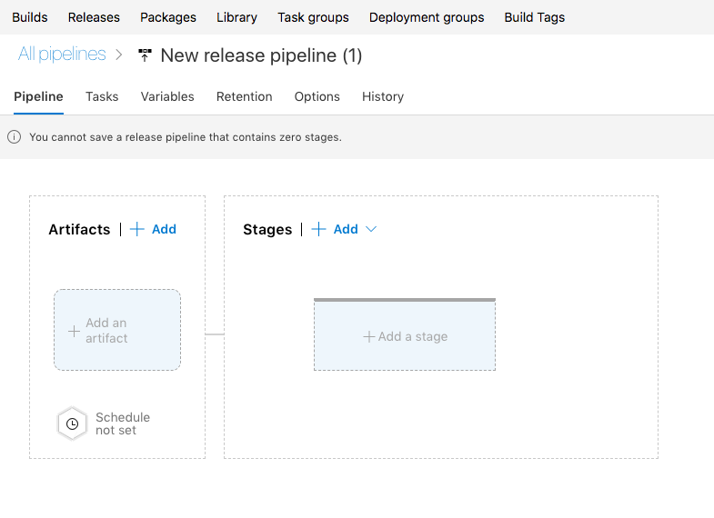

2. Connect the build artifact. This will take artifacts published by a build pipeline, which contain the Cloud Custodian policies and policy runner that we plan on deploying. The `Source alias` is the root directory of the build package, which we will call `artifacts`.

    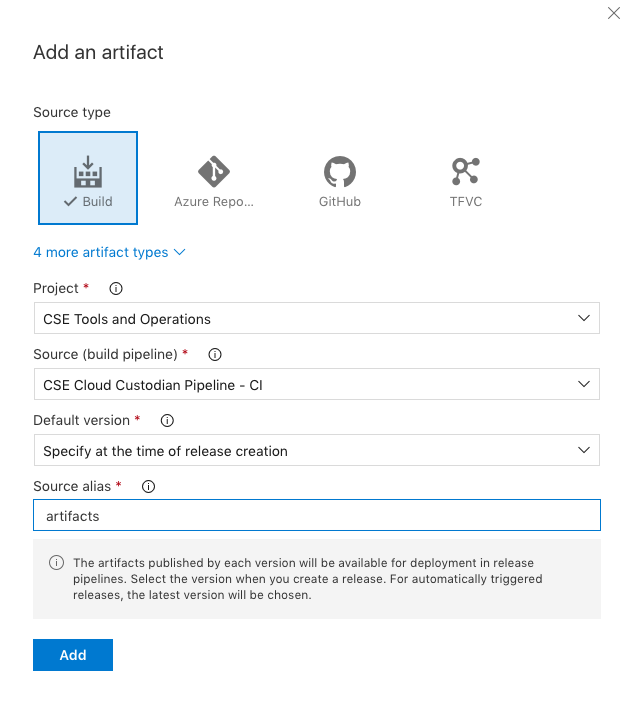

3. After adding a targeted build pipeline, enable continuous deployment by clicking the lightning bolt. Ensure the master branch is the targeted deployment branch.

    **Note**: Because this reference uses the same build pipeline for CI and PR validation, not setting master as the target branch will cause the release to deploy PR builds.

    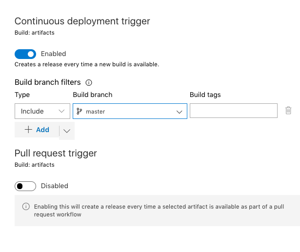

4. Add the following release variables, which the release tasks will reference. This will contain information such as file paths, Key Vault names, service connection names, and other information we will consume during the release. Use the same `service connection name` previously setup during the build.

    ```
    configFilePath : ./artifacts/package/policies/config.json
    keyVaultName : <key vault name>
    outputPath : azure://<storage_account>.blob.core.windows.net/custodianlogs
    policyFilePath : ./artifacts/package/policies/policies.release.json
    policyRunnerFile : ./artifacts/package/policy_runner.py
    secretsFilter : CustodianReleaseServicePrincipal,CustodianFunctionServicePrincipal
    serviceConnectionAzureSubscription : <service connection name>
    ```

    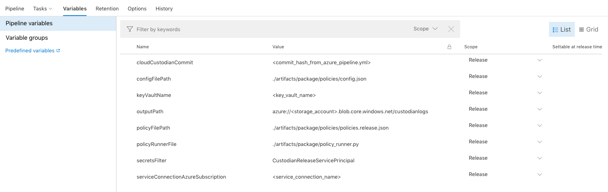

5. Add a new release stage and select empty job. We will fill this out throughout the guide.

    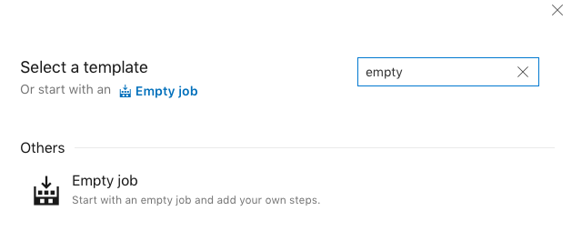

6. Ensure that our release stage is using the `Hosted Ubuntu 1604` image.

    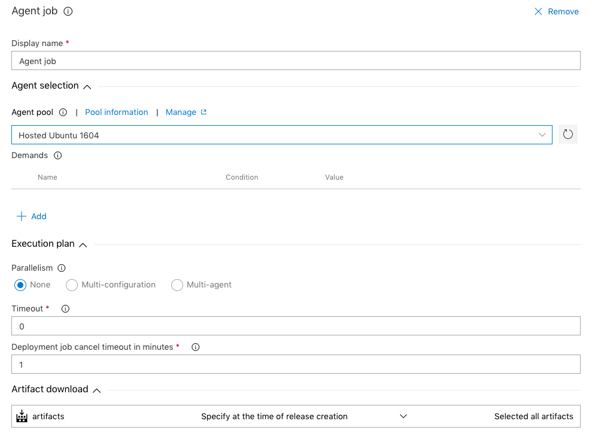

7. Add a task to use a Python version. Ensure that the Python version is `3.6`.

    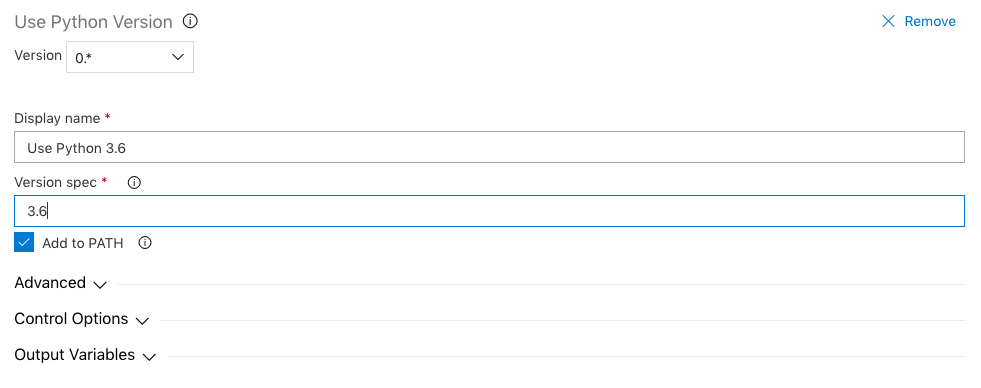

8. Cloud Custodian requires a `Service Principal` to modify Azure Resources. We previously stored this release service principal in Azure Key Vault during setup called `CustodianReleaseServicePrincipal`. To access this Key Vault, we previously established a service connection. Set this Azure Subscription and pull the keys from Key Vault.

    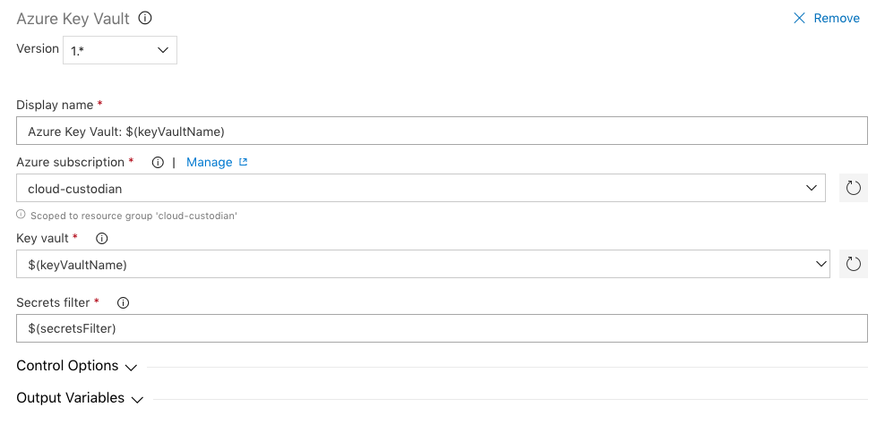

9. Install the necessary tools for installing custodian

    ```
    python -m pip install --upgrade pip setuptools wheel
    ```

    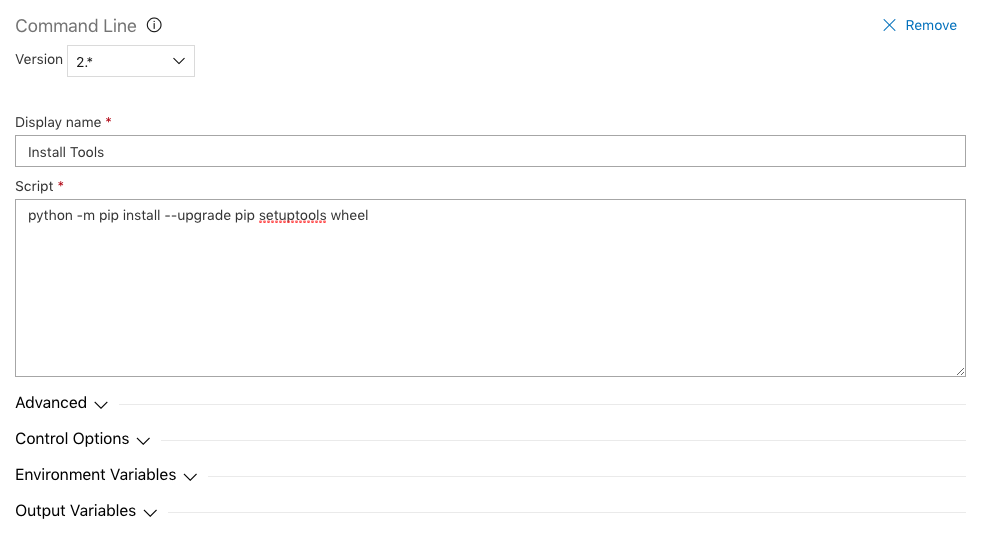

9. Install Cloud Custodian by using the python package artifacts published during the build. This will ensure we're always using the same version of Cloud Custodian as the build.

    ```
    pip install ./artifacts/package/c7n-dist/c7n.tar.gz
    pip install ./artifacts/package/c7n-dist/c7n_azure.tar.gz
    custodian version
    ```

    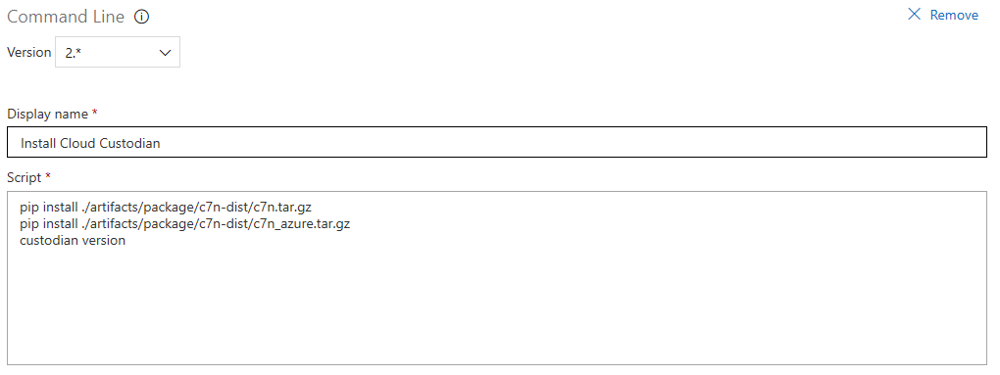

11. Deploy your validated policies that were packaged in your artifact by using the `policyRunnerFile`. This will ensure that your policies are deployed on Azure Functions and logs are stored on your specified storage account. Ensure your release is saved by clicking the `save` button before leaving.

    ```
    Script path: $(policyRunnerFile)
    Arguments: -c $(configFilePath) -p $(policyFilePath) -s $(CustodianReleaseServicePrincipal) -f $(CustodianFunctionServicePrincipal) -o $(outputPath)
    ```

    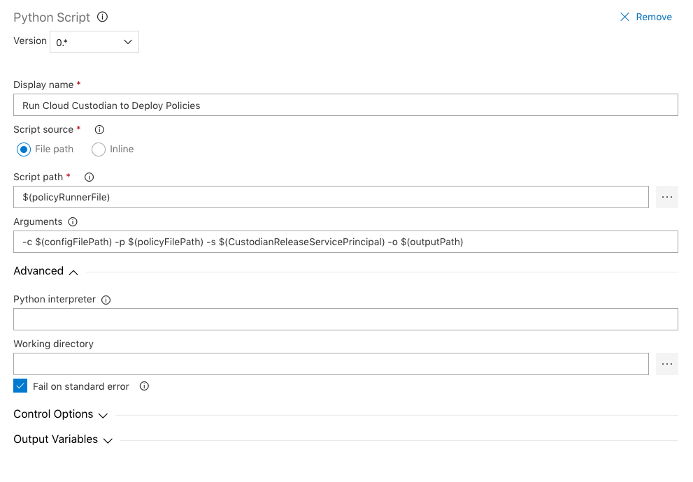