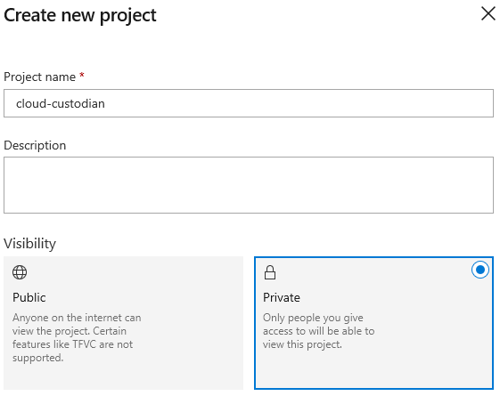
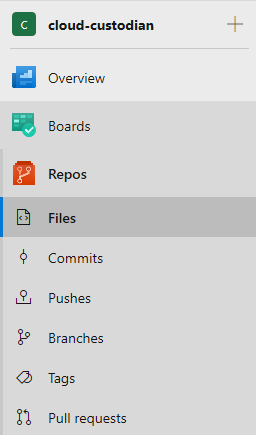
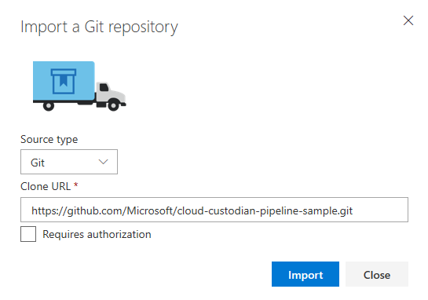
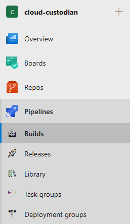
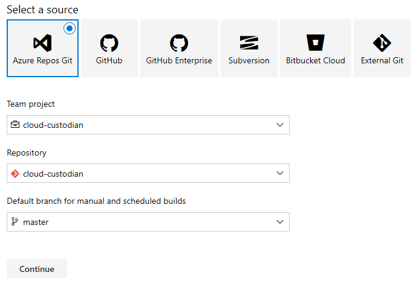
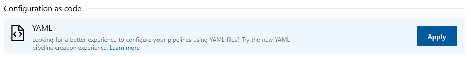
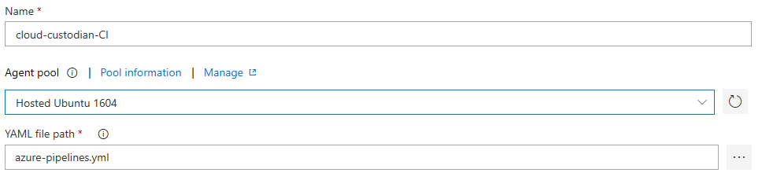
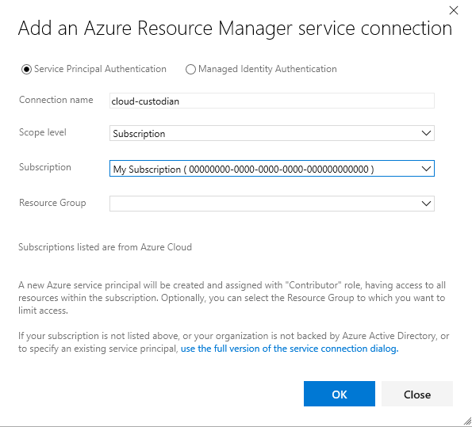
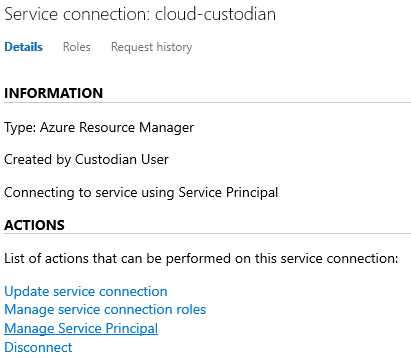
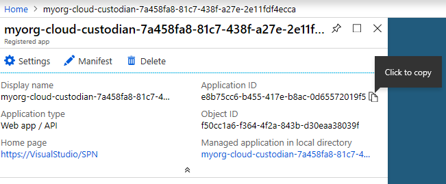

# Setup Guide

## Azure DevOps

The CI/CD portion of the pipeline runs on [Azure DevOps](https://docs.microsoft.com/en-us/azure/devops/user-guide/?view=vsts). Follow these steps to configure the pipeline in a new Azure DevOps project:



### Import Repository

Navigate to the repository and import the sample from GitHub





### Create a Build

Next, you'll create a [YAML-based build](https://docs.microsoft.com/en-us/azure/devops/pipelines/get-started-yaml?view=vsts) using Azure Pipelines. Choose the `Hosted Ubuntu 1604` agent pool and the `azure-pipelines.yml` build definition.









Next, you'll need to configure Azure DevOps so that it can connect to your Azure Subscription. Go to [Project Settings] -> [Pipelines] -> [Service connections] and add a new service connection for Azure Resource Manager.

### Create a Release

### Create a Service Connection



You'll need the Azure Active Directory appId for the Service Principal that was created so that you can grant it access to the secrets that are stored inside Key Vault. Follow these steps to get the appId. You'll use this when you run `setup.sh` to create the environment for your Cloud Custodian policies





## Azure resources

The pipeline needs a few Azure resources to execute and aggregate policy results. These are lined out in further detail in [`setup.md`](/../docs/setup.md) folder, and are described in code at [/src/setup](/src/setup). To get started quickly you can use the provided `setup.sh` helper script inside Azure Cloud Shell.

This script will create

* Service Principal for PR Builds
* Service Principal for Release pipeline to deploy policies
* Service Principal for Cloud Custodian policy execution
* Key Vault to store secrets
* Storage account for Custodian logs
* Storage account queue for Custodian policies to push notifications to
* [SendGrid Email Service](https://docs.microsoft.com/en-us/azure/sendgrid-dotnet-how-to-send-email) for sending Custodian email notifications

There are a few lines of output that you'll use in later steps when configuring your pipeline. They'll be written to STDOUT and saved to `setup.log`

```shell
# Clone the sample pipeline
git clone https://github.com/Microsoft/cloud-custodian-pipeline-sample.git
cd cloud-custodian-pipeline-sample/src/setup

# Run one-time setup in your Azure Subscription
# Usage: ./setup.sh CUSTODIAN_RG PIPELINE_SP SENDGRID_PASS LOCATION
# Example usage, substitute with your own values
./setup.sh cloud-custodian-rg 00000000-0000-0000-0000-000000000000 supersecretpassword westus2
```

## Custodian Mailer

Cloud Custodian does not directly send notifications to resource owners. Instead, it adds messages to an Azure Storage Queue and a Mailer component sends emails via SendGrid. You'll need to set up the Mailer if you want to notify users of policy violations via email. [Read more details on Cloud Custodian Mailer](https://github.com/capitalone/cloud-custodian/blob/master/tools/c7n_mailer/README.md#using-on-azure).

During the setup phase, the following Azure resources were created for the mailer.

* [SendGrid Email Service](https://docs.microsoft.com/en-us/azure/sendgrid-dotnet-how-to-send-email): Used by mailer to send email notifications
* [Azure Storage Queue](https://azure.microsoft.com/en-us/services/storage/queues/): A queue for Cloud Custodian to push policy notifications and for SendGrid to pull notifications to send.

A few extra steps are needed to fully configure the mailer to send notifications.

#### Get SendGrid API Token

In the resource group specified when running `setup.sh`, click on the SendGrid resource named `custodian-mailer`.


Next, click `Manage`. This will open the SendGrid portal.


In the left navigation of the SendGrid Portal, click `Settings` -> `API Keys`.


Click the `Create API Key` button to generate a new key. Give the API key a name, select `Restricted Access` and give `Full Access` to `Mail Send`. Make sure to copy the API key that is generated. We will need it in the next step.


#### Deploy Cloud Custodian mailer as an Azure Function

The Cloud Custodian mailer requires a YAML configuration file to work properly. This file is located in [/mailer/mailer.yml](/mailer/mailer.yml).

Open mailer.yml and replace the values for the following:

* `queue_url`: The storage account and storage queue that was created during setup.
* `from_address`: Set the value to the email address that notifications will be sent as.
* `sendgrid_api_key`: Set the value to the SendGrid API key generated previously.

Deploying Cloud Custodian to Azure Functions requires a Linux environment. You will need to run the next steps on a Linux OS or Linux Docker container.

Install and configure Cloud Custodian mailer on your machine by following [these installation instructions](https://github.com/capitalone/cloud-custodian/blob/master/tools/c7n_mailer/README.md#developer-install-os-x-el-capitan).

Cloud Custodian Mailer requires a `Service Principal` to access the storage queue. We will use the `CustodianReleaseServicePrinical` Service Principal to deploy the mailer as an Azure Function and the `CustodianFunctionServicePrincipal` Service Principal to run the mailer. Each of these Service Prinicpals were created when you ran [setup.sh](../src/setup/setup.sh). Ensure you have set the following environment variables before deploying the mailer. More details on Authentication can be [read here](http://capitalone.github.io/cloud-custodian/docs/azure/authentication.html). Also, ensure that `CustodianFunctionServicePrincipal` has the `Storage Queue Data Contributor` role assigned to the storage queue where messages will be pulled from.

```
export AZURE_TENANT_ID=<release_sp_tenant_id>
export AZURE_SUBSCRIPTION_ID=<subscription_id_to_deploy_mailer_to>
export AZURE_CLIENT_ID=<release_sp_app_id>
export AZURE_CLIENT_SECRET=<release_sp_secret>
export AZURE_FUNCTION_TENANT_ID=<function_sp_tenant_id>
export AZURE_FUNCTION_SUBSCRIPTION_ID=<subscription_id_to_deploy_mailer_to>
export AZURE_FUNCTION_CLIENT_ID=<function_sp_app_id>
export AZURE_FUNCTION_CLIENT_SECRET=<function_sp_secret>
```

Finally, run this command in the root of the repository to deploy the mailer.

```c7n-mailer --config mailer/mailer.yml --update-lambda```

## Configuration

It's time to add some configuration specific to your Azure environment. You'll do this by making commits to the Git repo inside your Azure DevOps project.

### Pipeline (`azure-pipelines.yml`)

You'll need to edit some of the variables in your `azure-pipelines.yml` file, specifically the following:

* `serviceConnectionAzureSubscription`: the name of the service connection you created in Azure DevOps (ex: `cloud-custodian`)
* `keyVaultName`: the name of the Key Vault that was created by `setup.sh`
* `repositoryId`: the id of your Azure DevOps Git repository. See [Project Settings] -> [Repositories] -> your repository. Your `repositoryId` will be contained in the URL in your browser

### Subscription (`config.json`)

To point the pipeline to the Azure Subscription where policies will be deployed, update `subscription` in `policies/config.json` with your own subscription ID.

You can quickly get a list of subscriptions that you have access to by running `az account list -o table`.

### Subscriptions policies will run against (`config.json`)

For all subscriptions that policies will run against, update `policy-subscriptions` in `policies/config.json` with your own subscription IDs.

You can quickly get a list of subscriptions that you have access to by running `az account list -o table`.
